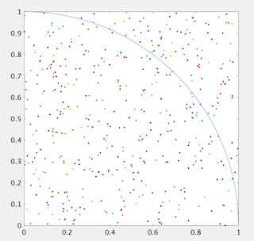

# monte-carlo-pi
乱数の機能を活用して、モンテカルロ法による円周率piの推定値をMATLABにより、シュミレーションして算出してみる。

## 概要
モンテカルロ法による円周率πの求め方は、２つの乱数（ｘ座標、ｙ座標）を発生させ、不規則に正方形の内に点を置いたときに、円の内部にある点の割合から円の面積を求める方法です。半径１の円の１/４を、一辺の長さが１の正方形の内に置くと、円の面積はπ/４になります。その正方形内に不規則な点を置き、（円の内にある点の数ｍ）/（全部の点の数ｎ）を円の面積と考えます。したがって、π/４＝ｍ/ｎ より、π＝4ｍ/ｎで円周率が求められます。

## デモ

## 使い方
`>>` test  
piの推定値は〇〇

## 文責
* 山本裕希
* 応用認知科学研究室
* a20.4x83@g.chuo-u.ac.jp

## ライセンス
この"monte-carlo-pi"は [MIT license] のもとで公開されています。(https://en.wikipedia.org/wiki/MIT_License).

